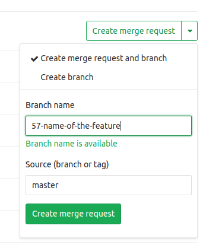
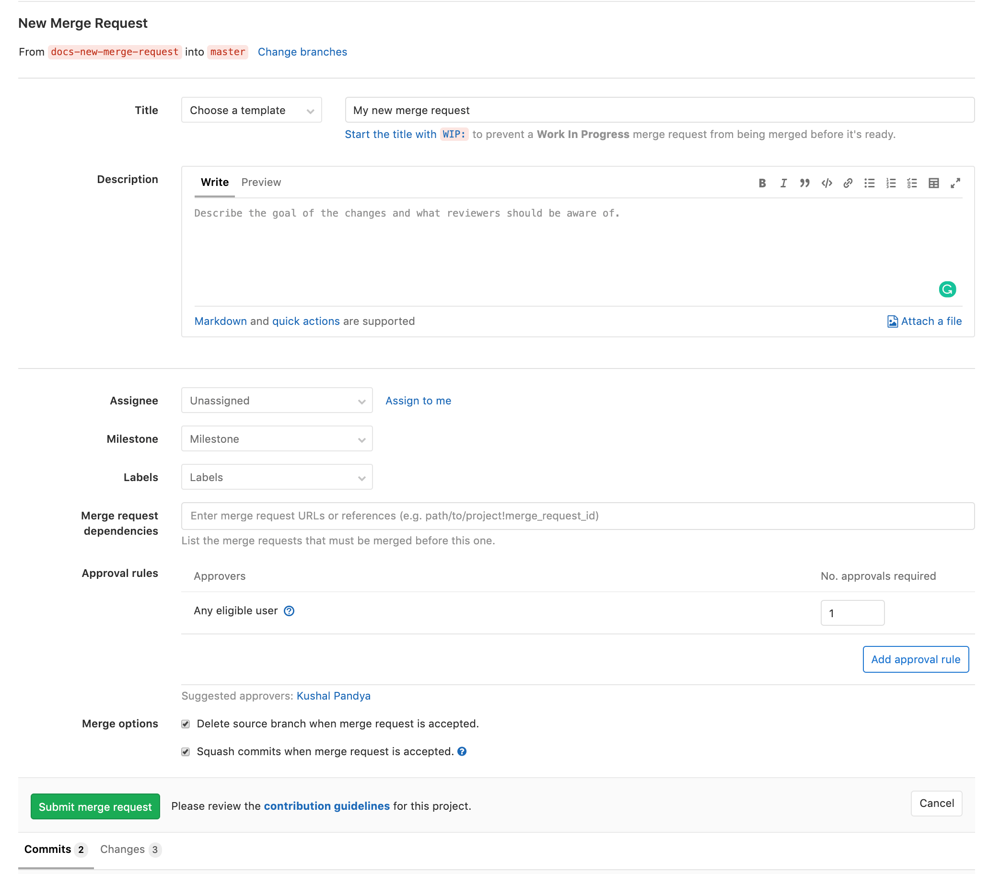
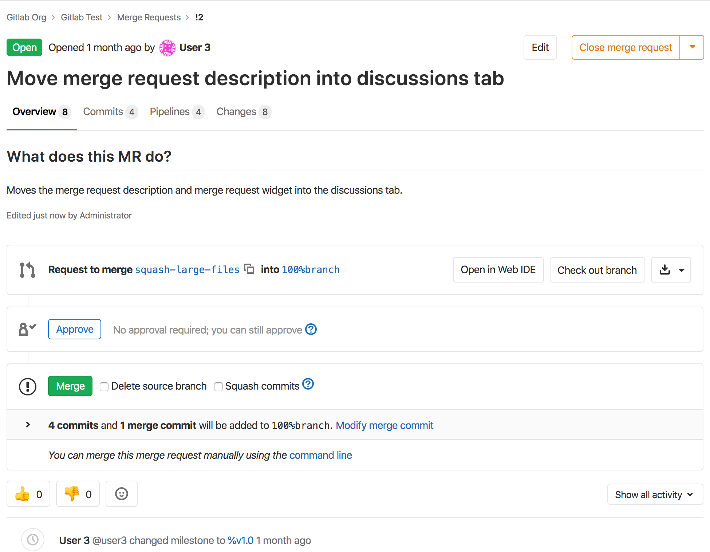
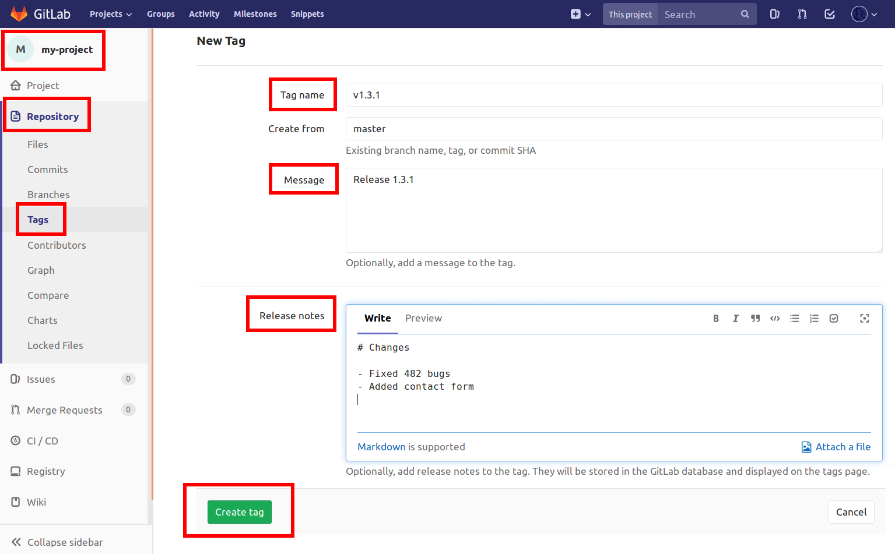
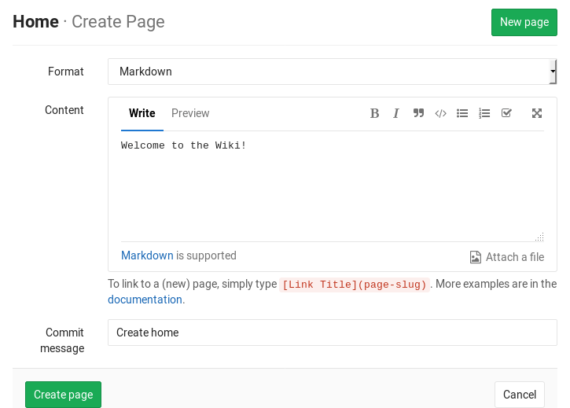
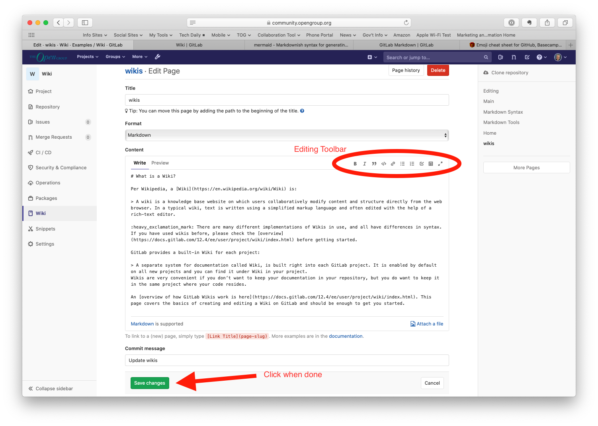
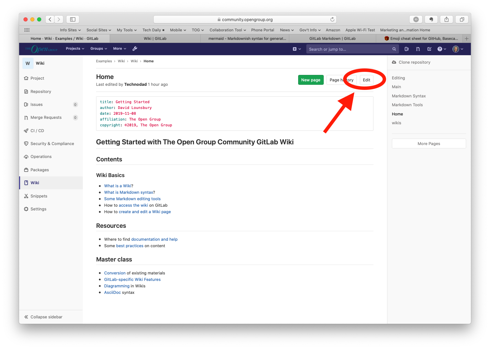

# Working with GitLab
## Table of contents
1. creating a personal repository with the correct .gitignore and simple README.MD
2. creating develop and master branches
3. setting the develop branch as the default
4. creating an issue for creating the current manual
5. creating a branch for the issue
6. creating a merge request on the develop branch
7. commenting and accepting the request
8. creating a stable version in the master with a tag
9. working with wiki for the project

## Creating a personal repository
1. On the top bar, select Menu > Create new project.
2. On the Create new project page, choose create a blank project.
3. Enter the project details like project name, slug, description, target, visibility level
4. To create README file select Initialize repository with a README.
5. To create .gitignore file from a project’s files page, click the "+" button to the right of the branch selector. Choose New file from the dropdown. When clicking on a .gitignore on template dropdown, it displays a template that may be suitable for your project.

## Creating develop and master branches
Master branch will be created automatically when repository will be created, to create develop branch:
1. From a project’s files page, click the "+" button to the right of the branch selector and choose New branch from the dropdown.
2. Enter a new branch name: develop
3. Optional. Change the Create from field to choose which branch, tag, or commit SHA this new branch originates from. This field autocompletes if you start typing an existing branch or tag.
4. To return to the file browser on this new branch, select Create branch.

## Creating an issue for creating the current manual
1. On the top bar, select Menu > Projects and find your project.
2. On the top bar, select the "+" button and then, under this project, select New issue.
3. Complete the fields:
Title = Create mannual on using GitLab 
Type = issue
Description = Prepare a brief manual on using GitLab in the src/gitlab_manual.md file, using Markdown.
Uncheck confidential vheckbox and leave other fileds with default values
4. Select Create issue.

## Creating a branch for the issue
1. Go to Issue screen
2. Check a green button labeled "Create a merge request", with a down-arrow to its right. That would be dropbox which includes the "Create Branch" option.

## Creating a merge request on the develop branch
You can create a merge request from the list of merge requests.
1. From a project’s files page, select "develop" in the branch selector
2. On the left menu, select Merge requests.
3. In the top right, select New merge request.
4. Select a source and target branch and then Compare branches and continue.
5. Fill out the fields and select Create merge request.

## Commenting and accepting the request
You can add comments to a merge request diff:
1. To select a specific commit, on the merge request, select the Commits tab, select the commit message. To view the latest commit, select the Changes tab.
2. By the line you want to comment on, hover over the line number and select Comment. You can select multiple lines by dragging the Comment icon.
3. Enter your comment and select Start a review or Add comment now.
4. To merge the request click "Merge" button

## Creating a stable version in the master with a tag

To create a stable version(release) on the GitLab:
1. Go to your repository
2. In the menu choose Repository > Tags
3. Add a tag for the version of your app. For example, v5.1.1.
4. Add a message (title) about the release. For example, Release 5.1.1.
5. Add a note that describes the details of the release. (Not optional. Adding a note to a tag is what makes it a release.)
6. Click Create tag.

# Working with GitLab's project wiki
If you don’t want to keep your documentation in your repository, but you want to keep it in the same project as your code, you can use the wiki GitLab provides in each GitLab project. Every wiki is a separate Git repository, so you can create wiki pages in the web interface.

## View a project wiki
To access a project wiki:
1. On the top bar, select Menu > Projects and find your project.
2. To display the wiki, either:
3. On the left sidebar, select Wiki.
4. On any page in the project, use the g + w wiki keyboard shortcut.
5. If Wiki is not listed in the left sidebar of your project, a project administrator has disabled it.

## Create a new wiki page
Users with at least the Developer role can create new wiki pages:
1. On the top bar, select Menu.
2. For project wikis, select Projects and find your project.
3. For group wikis, select Groups and find your group.
4. On the left sidebar, select Wiki.
5. Select New page on this page, or any other wiki page.
6. Select a content format.
7. Add a title for your new page. Page titles use special characters for subdirectories and formatting, and have length restrictions.
8. Add content to your wiki page.
9. Optional. Attach a file, and GitLab stores it in the wiki’s Git repository.
10. Add a Commit message. Git requires a commit message, so GitLab creates one if you don’t enter one yourself.
11. Select Create page.

## Edit a wiki page
1. On the top bar, select Menu.
2. For project wikis, select Projects and find your project.
3. For group wikis, select Groups and find your group.
4. On the left sidebar, select Wiki.
5. Go to the page you want to edit, and either:
6. Use the e wiki keyboard shortcut.
7. Select the edit icon ().
8. Edit the content.
9. Select Save changes.

## Create a table of contents
To generate a table of contents from a wiki page’s subheadings, use the [[_TOC_]] tag. For an example, read Table of contents.

## Delete a wiki page
1. On the top bar, select Menu.
2. For project wikis, select Projects and find your project.
3. For group wikis, select Groups and find your group.
4. On the left sidebar, select Wiki.
5. Go to the page you want to delete.
6. Select the edit icon ().
7. Select Delete page.
8. Confirm the deletion.

## Move a wiki page
1. On the top bar, select Menu.
2. For project wikis, select Projects and find your project.
3. For group wikis, select Groups and find your group.
4. On the left sidebar, select Wiki.
5. Go to the page you want to move.
6. Select the edit icon ().
7. Add the new path to the Title field. For example, if you have a wiki page called about under company and you want to move it to the wiki’s root, change the Title from about to /about.
8. Select Save changes.
